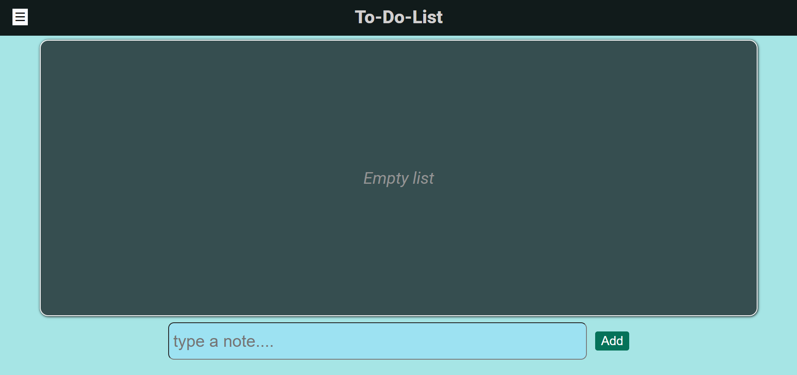
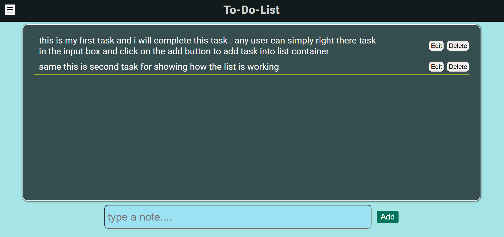
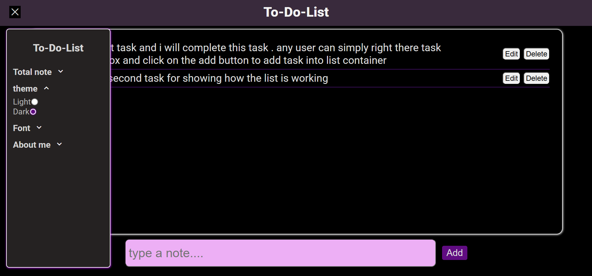
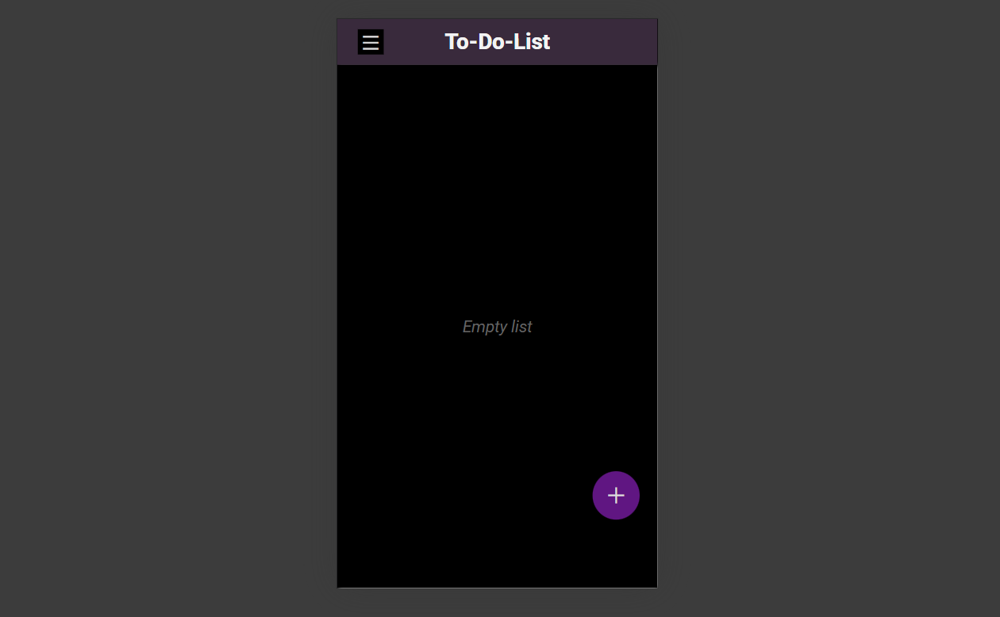
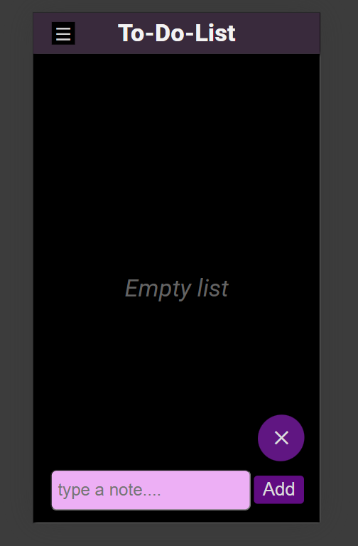

# to_do_list

## Description
A responsive Todo list website that helps users manage daily tasks efficiently . It is built using HTML,CSS and JavaScript . The app uses browser Local Storage to save tasks permanently so that data is not lost on page referesh.

## Features
- When there are not task, the app shows an "Empty List" message in the task container, when the user adds a task, the "Empty List" message automatically disappears.
- An input field is provided where users can type their task, and by clicking the add button , the task is added to the list instantly. 
- A menu icon is provided which opens the slidebar menu when clicked . The menu automatically closes when the users clicks anywhere autside the menu or clicks the menu icon agian.
- The first option in the menu bar shows the total number of tasks in the list. This count updates dynamically whenever a task is added or removed .
- The website includes a theme switcher with two modes: Light and Dark . Users can easily toggle between themes with a single click, and the selected theme is preserved using Local Storage even after page referesh.
- The app includes a font switcher with three different font options. Users can easily change the font with a single click, and the selected font is saved using Local Storage so it remains applied even after page refresh.
- Each task in the list comes with Edit and Delete options. Users can easily modify a task using the edit button or remove it completely using the delete button.
- The website is fully responsive, ensuring a smooth and user-friendly experience on all screen sizes including mobile, tablet, and desktop devices.

## Technologies Used
1. HTML
2. CSS
3. JavaScript

## Screenshots

*todo list first screenshot*

*dark theme*

*Responsive website*

## How to Run
1. Clone or download the repository
2. Open 'index.html' in any web browser

## live demo
*check out the live version of my todo list website*
- [click here to view live](https://praveensharma890.github.io/to_do_list/)

## Author
Praveen Sharma